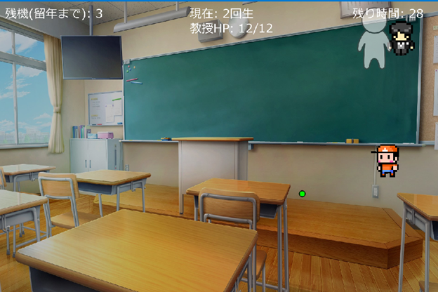
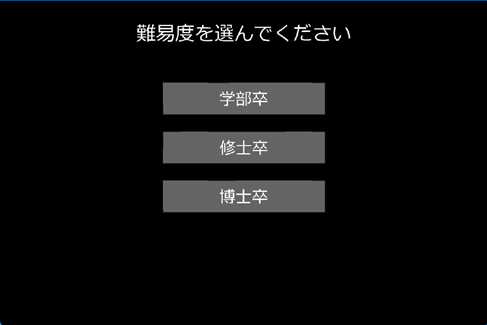
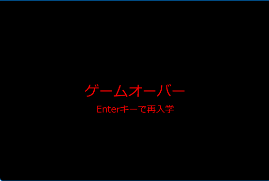
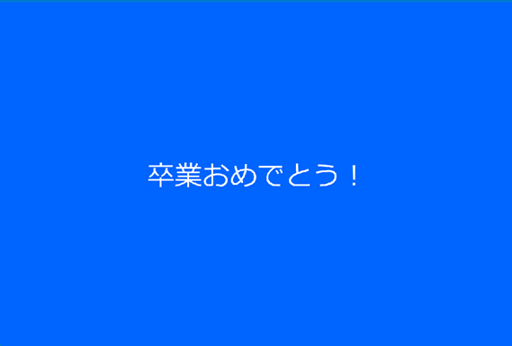

# team01
ソフトウェア工学Ⅱのための練習用リポジトリ

河野智洋
秋山優
小松夕姫菜

## 目指せ大卒！シューティングゲーム
 * 1回生、2回生…というようにステージが上がっていく
 * 残機は留年数
 * 自分が攻撃しながら相手の攻撃もかわす
 * 敵は教授
 * 教授がレポートを撃ってくる
 * 教授は「必修」「選択」などの服を着ている
 * 敵側アシストにＴＡ
 * ＴＡさんはフェードアウトしていく
 * 十字キーで前後左右に移動できる
 * 自分が攻撃するときスペースキーなどを押す
 * 教授を倒してステージを進める
 * 教授は左右に動く
 * 難易度設定で、学部卒、修士卒、博士卒の順に難しくなる
 * 制限時間あり
 * 時間内に倒せない、または敵の攻撃によって死んだ場合ゲームオーバー

 ##　説明書
1. ゲーム概要 
あなたが学生となって、教授やティーチングアシスタント（TA）が提示する学業上の課題を乗り越え、卒業を目指すゲームです。最終目標は、すべてのステージをクリアして無事に卒業することです。  
2. 遊び方  
プレイヤーキャラクターは画面下部に、敵は画面上部から出現します。  
3. 操作方法  
•	移動: 矢印キー（上、下、左、右）を使ってキャラクターを移動させます。  
	左矢印: 左に移動します 。  
	右矢印: 右に移動します 。  
	上矢印: 画面の上半分内で上に移動します 。  
	下矢印: 画面の下半分内で下に移動します 。  
•	攻撃: スペースキーを押して弾を発射します 。  発射後には短いクールダウン時間があります 。  
4. ゲーム要素  
4.1. プレイヤー  
あなたは学生キャラクターを操作します。目的は、生き残り、敵を倒すことです。  
•	残機（留年まで）: プレイヤーは3つのライフ（残機）から開始します 。ライフがすべてなくなるとゲームオーバーです 。UIには「残機(留年まで): 」に続いて現在のライフ数が表示されます 。  
•	プレイヤー画像: あなたのキャラクターは「player.png」の画像で表示されます 。画像は表示のために元のサイズの1/4に縮小されます 。  
•	プレイヤーの弾: あなたの弾は「main_bull.png」の画像で表示されます 。これらの弾はゲーム内の他の画像よりも小さく表示されます 。  
4.2. 敵  
4.2.1. 教授  
主要な敵です。  
•	移動: 「教授」は画面上部を水平に移動し、画面の端に当たると向きを変えます 。  
•	攻撃: 「教授」は定期的に弾を発射します 。これらの弾は「enemy_bull.png」の画像で表示されます 。  
•	HP: UIには「教授HP」が表示され、現在のHPと最大HPが示されます 。  
•	ダメージ: プレイヤーの弾が「教授」に当たると、HPが減少します 。  
•	撃破: 「教授」のHPがゼロになると、現在のステージをクリアします 。  
4.2.2. TA   
•	出現: TAはステージ2から出現します 。  
•	移動: TAは「教授」の水平移動に追従します 。  
•	攻撃: TAは定期的に弾を発射しようとします 。  
•	透明度: TAの透明度は時間とともに減少し、最終的に消滅します 。  
•	ビジュアル: TAは「TA.png」の画像で表示され、元のサイズの半分に縮小されます 。  
•	  
4.3. ユーザーインターフェース   
UIは重要なゲーム情報を提供します。  
•	残機: 「残機(留年まで): 」に続いて残りのライフ数が表示されます 。  
•	残り時間: 「残り時間: 」に続いて残り時間が秒単位で表示されます（タイマー値が60で割られます） 。  
•	現在のステージ: 「現在: 」に続いて現在のステージ番号と「回生」が表示されます（例：「現在: 2回生」） 。  
•	教授HP: 「教授HP: 」に続いて「教授」の現在のHPと最大HPが表示されます 。  
5. ゲームの進行  
5.1. メインメニュー  
  
ゲーム開始時、メインメニューが表示され、難易度を選択できます 。  
•	学部卒   
•	修士卒   
•	博士卒   
難易度ボタンをクリックすると、ゲームの難易度が設定され、ゲーム状態がリセットされ、ゲームが開始されます 。  
   
5.2. ステージ  
•	ゲームは複数のステージで構成されており、ステージが進むにつれて難易度が上がります 。  
•	各ステージでは、「教授」の移動速度、HP、発射間隔、弾の速度が設定されます 。  
•	「教授」を倒すと、次のステージに進みます 。  
•	ステージ4をクリアすると、ゲームに勝利します 。  
5.3. ゲームオーバー  
以下のいずれかの条件でゲームは終了します。  
   
•	ライフが0になる 。  
•	ステージの制限時間が終了する 。  
5.4. ゲームクリア  
   
すべてのステージを完了すると、「卒業おめでとう！」というメッセージが表示されます 。  
6. オーディオ  
•	BGM : ゲームにはBGMが含まれています 。  
•	効果音:  
	敵ダメージ: 敵がダメージを受けると音が鳴ります 。  
	プレイヤーダメージ: プレイヤーがダメージを受けると音が鳴ります 。  
	射撃: プレイヤーが弾を発射すると音が鳴ります 。  

